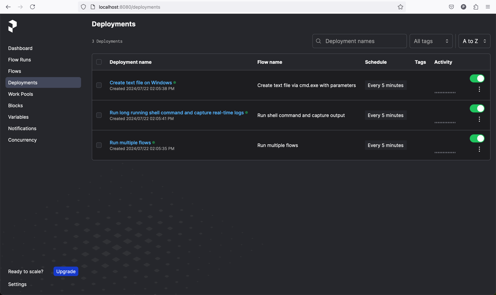

# zoe-prefect

**zoe-prefect** is a project designed to provide examples, how to manage and deploy testing/job infrastructure using Prefect.

## Terms / Glossary
- **Prefect**: open-source workflow orchestration tool that allows you to build, run, and monitor data workflows. It provides a flexible and scalable way to manage complex workflows, ensuring that tasks are executed in the correct order and handling retries, logging, and error handling automatically.
- **Job / Task / Test**: An work item that needs to be computed on a machine more than one time. The term Test is a Job with the results being checked. Use the term Task to match it with Prefect terminology.
- **Prefect flow**: container for workflow logic/jobs/tasks as-code and allows users to configure how their workflows behave. Flows are defined as Python functions, and any Python function is eligible to be a flow by adding the `@flow` decorator.
- **Prefect task**: function that represents a discrete unit of work in a Prefect workflow. Tasks are not required — you may define Prefect workflows that consist only of flows, using regular Python statements and functions. Tasks enable you to encapsulate elements of your workflow logic in observable units that can be reused across flows and subflows. Task can be created by adding `@task` annotation to existing function.
- **Worker**: The target machine where the flow(s) is executed

## Prefect components
### 1) Prefect server

Prefect Server The Prefect Server is the central component that manages and coordinates all the workflows. It provides a user interface where users can visualize and manage their flows. The server acts as the orchestrator, scheduling workflows, tracking their progress, and handling failures or retries. It communicates with various other components, like workers to execute tasks and database to store results. The server itself can be deployed locally or hosted as a managed service (Prefect Cloud).

### 2) Prefect worker(s)

Workers are the execution units in Prefect that actually run the tasks defined in your workflows. They execute the code of your tasks and return the results to the server. Workers can be:

- **Local**: Running on the same machine as the server.
- **Distributed**: Spread across multiple machines or even different geographic locations. For example, it can be a few Windows based machines, one Linux based, 10 cloud based, etc.

Workers listen for flow runs dispatched by the Prefect server and process them as they come. They are responsible for the actual computational work, such as data collecting, verifications, running applications, etc.
### 3) Database

Prefect utilizes databases to store and manage all the metadata related to your workflows. This includes information about task runs, their statuses, logs, and other execution metadata.

## Project Structure
- **content_files/**: Contains files used in content verification flow.
- **deployments/**: Contains deployment scripts and utilities.
    - [deploy_all_from_git.py](deployments/deploy_all_from_git.py): Script to deploy flows from the Git repository to Prefect server.
    - [deployments_utils.py](deployments/deployments_utils.py): Utility functions for deployments.
- **flows/**: Contains the Prefect flows/jobs/tasks.
    - [content_filenames_verification_flow.py](flows/content_filenames_verification_flow.py): Flow to verify content filenames.
    - [create_file_on_windows.py](flows/create_file_on_windows.py): Flow to create a text file on Windows using cmd.exe.
    - [run_multiple_flows.py](flows/run_multiple_flows.py): Flow to run multiple flows in parallel.
    - [run_shell_command.py](flows/run_shell_command.py): Parametrized flow to run shell commands and capture stdout logs.
    - [simple_print_flow.py](flows/simple_print_flow.py): Simple flow to print a message.
    - **utils/**: Utility functions for the flows.
        - [shell_utils.py](flows/utils/shell_utils.py): Utility wrapper for easily using of ShellTask and capture logs.
- [**docker-compose.yaml**](docker-compose.yaml): Docker Compose configuration file for easy installation and running locally.
- [**.prefectignore**](.prefectignore): Prefect ignore file.
- [**.gitignore**](.gitignore): Git ignore file.
- [**readme.md**](readme.md): Project documentation file.

## Installation steps
1) Clone the Git repository locally on your machine:
    ```sh
    git clone https://github.com/pavlo-sevidov-datavise/prefect-demo.git
    cd prefect-demo
    ```
2) Make sure [Docker and docker-compose](https://docs.docker.com/engine/install/) are installed.
3) Run the following command to start the services:
    ```sh
    docker-compose up -d
    ```
4) Open [http://localhost:8080/deployments](http://localhost:8080/deployments) to view the deployments.

This is a screenshot of how Deployments page should look like. It might take a few minutes for deployments to appear on UI.
On the screenshots you can find three deployments that are manually defined in the [deploy_all_from_git.py](deployments/deploy_all_from_git.py).
They are configured to run each 5 minutes.



## Stop services
1) Run the following command to stop the services:
    ```sh
    docker-compose down
    ```

# Docker Compose Configuration

This part provides an explanation of the `docker-compose.yaml` file used in this project.
Docker compose is used for easy installation purposes to display similar to production environment.

## Services

#### 1. Database - Postgres

The `postgres` service sets up a PostgreSQL database, which is used by the Prefect server to store metadata about workflows, task runs, and their statuses. It can be replaced by other databases.

#### 2. Prefect Server

The `server` service sets up the Prefect server, which is the central component that manages and coordinates all the workflows.


#### 3. Prefect Worker

The `worker` service sets up a Prefect worker, which is responsible for executing the tasks defined in your workflows. In this example it's running on Unix-based docker image. It can be easily replaced by Windows based machines. It's only required to install Git, Python and Prefect to start additional worker.

#### 4. Build and Run Deployment Scripts

This separate machine that is responsible for providing Prefect Server workflows metadata such as how to get tests, how and when to run them.
In our example our case it runs hard-coded deployment script which specified that flows are stored in Github repository and to run them each 5 minutes.


# TBD how to use Prefect UI and check result.
# TBD explain deployment script with details
# TBD explain how to run `@flow` locally

## Contributing
Feel free to open issues or submit pull requests if you find any bugs or have suggestions for improvements.

## License
This project is licensed under the MIT License.

