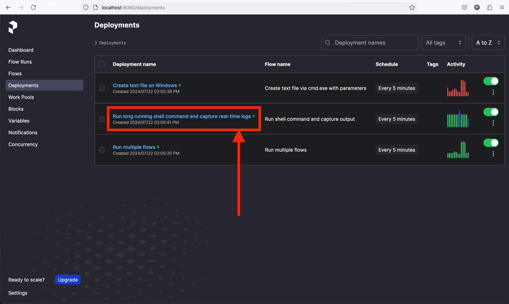
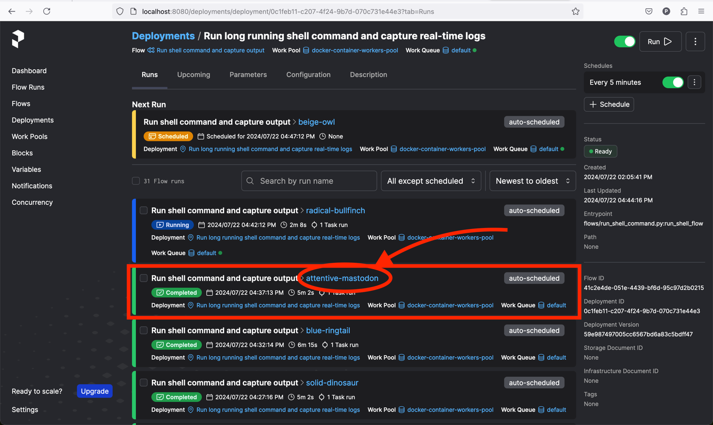
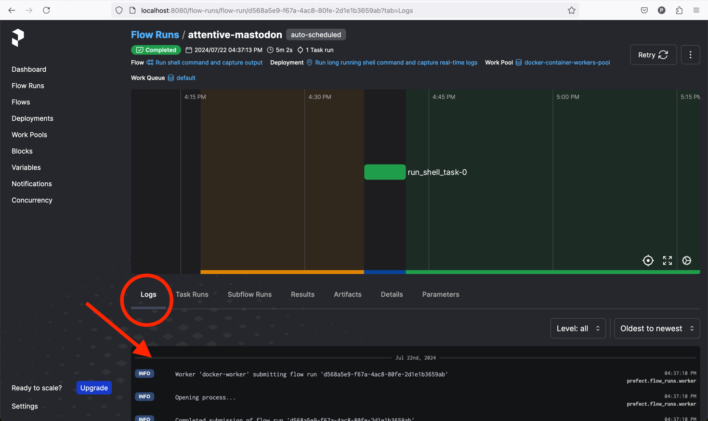
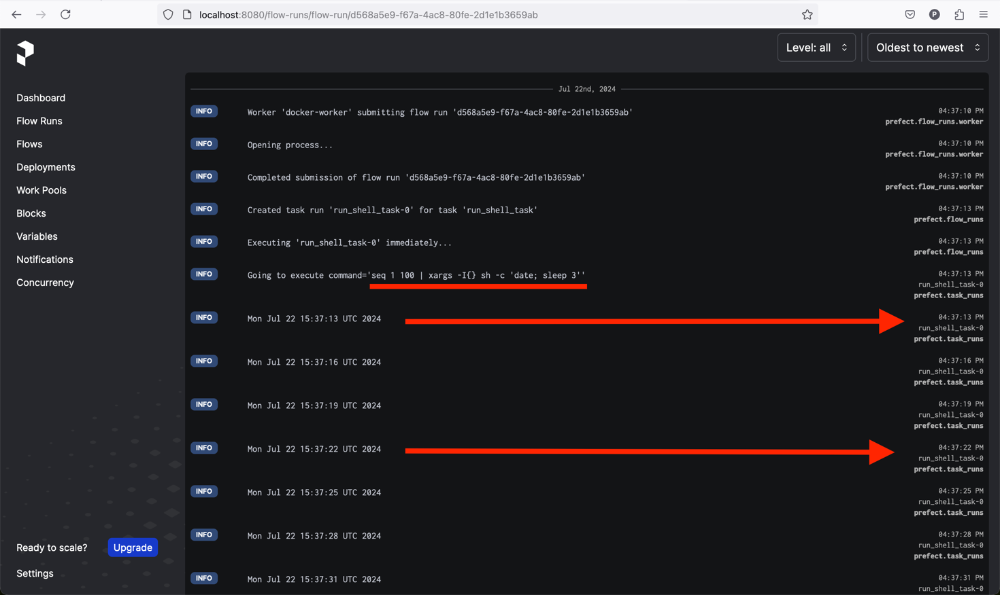

# zoe-prefect

**zoe-prefect** is a project designed to provide examples, how to manage and deploy testing/job infrastructure using Prefect.

## Terms / Glossary
- **Prefect**: open-source workflow orchestration tool that allows you to build, run, and monitor data workflows. It provides a flexible and scalable way to manage complex workflows, ensuring that tasks are executed in the correct order and handling retries, logging, and error handling automatically.
- **Job / Task / Test**: An work item that needs to be computed on a machine more than one time. The term Test is a Job with the results being checked. Use the term Task to match it with Prefect terminology.
- **Prefect flow**: container for workflow logic/jobs/tasks as-code and allows users to configure how their workflows behave. Flows are defined as Python functions, and any Python function is eligible to be a flow by adding the `@flow` decorator.
- **Prefect task**: function that represents a discrete unit of work in a Prefect workflow. Tasks are not required — you may define Prefect workflows that consist only of flows, using regular Python statements and functions. Tasks enable you to encapsulate elements of your workflow logic in observable units that can be reused across flows and subflows. Task can be created by adding `@task` annotation to existing function.
- **Worker**: The target machine where the flow(s) is executed

## Prefect components
### 1) Prefect server

Prefect Server The Prefect Server is the central component that manages and coordinates all the workflows. It provides a user interface where users can visualize and manage their flows. The server acts as the orchestrator, scheduling workflows, tracking their progress, and handling failures or retries. It communicates with various other components, like workers to execute tasks and database to store results. The server itself can be deployed locally or hosted as a managed service (Prefect Cloud).

### 2) Prefect worker(s)

Workers are the execution units in Prefect that actually run the tasks defined in your workflows. They execute the code of your tasks and return the results to the server. Workers can be:

- **Local**: Running on the same machine as the server.
- **Distributed**: Spread across multiple machines or even different geographic locations. For example, it can be a few Windows based machines, one Linux based, 10 cloud based, etc.

Workers listen for flow runs dispatched by the Prefect server and process them as they come. They are responsible for the actual computational work, such as data collecting, verifications, running applications, etc.
### 3) Database

Prefect utilizes databases to store and manage all the metadata related to your workflows. This includes information about task runs, their statuses, logs, and other execution metadata.

## Hot to create Prefect flow

Let's imagine we have simple Hello World python script that we want to convert to Prefect flow.
```python
def main():
    print("Hello, World!")

if __name__ == "__main__":
    main()
```
We would need to do two things to convert it to prefect flow
1) Add import in the beginning of the file `from prefect import flow`
2) Add '@flow' annotation to **main** function

End result would be
```python
from prefect import flow

@flow(log_prints=True)
def simple_print_flow():
    print("Hello, World!")

if __name__ == "__main__":
    simple_print_flow()
```
Congratulations this script can be recognized by Prefect Server to be run on workers since we added `@flow` annotation.

One more thing to note, there is `log_prints=True` parameter added to `@flow` annotation. This optional parameter can be used to automatically pick up all python `print` statements by Prefect logger. These logs will be pushed to Prefect Server and stored in database.
This is amazing way to stop worrying by configuring loggers, making sure they are used in all places since Prefect will pick up your print statements and wrap into info logs automatically.

**Example of executing this hello_world.py script**
```shell
➜  python flows/simple_print_flow.py
13:18:58.872 | INFO    | prefect.engine - Created flow run 'shrewd-sheep' for flow 'simple-print-flow'
13:18:58.887 | INFO    | Flow run 'shrewd-sheep' - Hello, World!
13:18:58.896 | INFO    | Flow run 'shrewd-sheep' - Finished in state Completed()
➜  
```
Prefect picked up `print("Hello, World!")` and converted into log lines.

You can find this example under [flows/simple_print_flow.py](flows/simple_print_flow.py).

This is why you can write regular python scripts to achieve desired functionality and convert them into Prefect flows just by adding single `@flow` annotation.

Feel free to discover other examples of tasks under **flows** folder.

## Project Structure
- **content_files/**: Contains files used in content verification flow.
- **deployments/**: Contains deployment scripts and utilities.
    - [deploy_all_from_git.py](deployments/deploy_all_from_git.py): Script to deploy flows from the Git repository to Prefect server.
    - [deployments_utils.py](deployments/deployments_utils.py): Utility functions for deployments.
- **flows/**: Contains the Prefect flows/jobs/tasks.
    - [content_filenames_verification_flow.py](flows/content_filenames_verification_flow.py): Flow to verify content filenames.
    - [create_file_on_windows.py](flows/create_file_on_windows.py): Flow to create a text file on Windows using cmd.exe (**expected to fail**)
    - [run_multiple_flows.py](flows/run_multiple_flows.py): Flow to run multiple flows.
    - [run_shell_command.py](flows/run_shell_command.py): Parametrized flow to run shell commands and capture stdout logs.
    - [simple_print_flow.py](flows/simple_print_flow.py): Simple flow to print 'Hello, World' a message.
    - **utils/**: Utility functions for the flows.
        - [shell_utils.py](flows/utils/shell_utils.py): Utility wrapper for easily using of ShellTask and capture logs.
- [**docker-compose.yaml**](docker-compose.yaml): Docker Compose configuration file for easy installation and running locally.
- [**.prefectignore**](.prefectignore): Prefect ignore file.
- [**.gitignore**](.gitignore): Git ignore file.
- [**readme.md**](readme.md): Project documentation file.

## How to run this demo locally using Docker
1) Clone the Git repository locally on your machine:
    ```sh
    git clone https://github.com/pavlo-sevidov-datavise/prefect-demo.git
    cd prefect-demo
    ```
2) Make sure [Docker and docker-compose](https://docs.docker.com/engine/install/) are installed.
3) Run the following command to start the services:
    ```sh
    docker-compose up -d
    ```
4) Open [http://localhost:8080/deployments](http://localhost:8080/deployments) to view the deployments.

5) Expected result

This is a screenshot of how Deployments page should look like. It might take a few minutes for deployments to appear on UI.
On the screenshots you can find three deployments that are manually defined in the [deploy_all_from_git.py](deployments/deploy_all_from_git.py).
They are configured to run each 5 minutes.


## Stop services
1) Run the following command to stop the services:
    ```sh
    docker-compose down
    ```

# Docker Compose Configuration

This part provides an explanation of the `docker-compose.yaml` file used in this project.
Docker compose is used for easy installation purposes to display similar to production environment.

### Services

#### 1. Database - Postgres

The `postgres` service sets up a PostgreSQL database, which is used by the Prefect server to store metadata about workflows, task runs, and their statuses. It can be replaced by other databases.

#### 2. Prefect Server

The `server` service sets up the Prefect server, which is the central component that manages and coordinates all the workflows.


#### 3. Prefect Worker

The `worker` service sets up a Prefect worker, which is responsible for executing the tasks defined in your workflows. In this example it's running on Unix-based docker image. It can be easily replaced by Windows based machines. It's only required to install Git, Python and Prefect to start additional worker.

#### 4. Build and Run Deployment Scripts

Service responsible for providing Prefect Server workflows metadata such as how to get tests, how and when to run them.
In our example our case it runs hard-coded deployment script which specified that flows should be fetched from Github repository and execute them each 5 minutes.


## How to run Prefect flow/task locally
The best part of prefect is that Prefect flows are simple python functions that has `@flow` annotations.
This means that one can run python scripts locally for verification just by running any python script `python path/to/file.py`.

### Steps required to run Prefect flow locally
1) Install Python ([Python installation docs](https://www.python.org/downloads/))
2) Install pip (usually it will be installed with Python)
3) Install prefect using pip `pip install -U prefect` (see [Prefect installation docs](https://docs.prefect.io/latest/getting-started/installation/))
4) Run your python script `python path/to/file.py`

## How to Prefect flow runs logs via UI

Let's take a look how to check logs for [run_shell_command.py](flows/run_shell_command.py) flow which runs long running shell command by default and capture stdout logs in real-time.

This flow demonstrates example of long running process (or a game) that needs to be run with certain parameters and how it captures stdout logs in real-time.
Under the hoot it executes command that prints current date 100 times with 3 seconds delay. In other words it will be running for 5 minutes.
Default shell command
```shell
seq 1 100 | xargs -I{} sh -c 'date; sleep 3'
```

#### How to check logs for this flow runs
1) Run this demo locally using this guide [How to run this demo locally using Docker](#how-to-check-run-manually-prefect-flows-via-ui-and-check-result)
2) Open "Deployments" tab http://localhost:8080/deployments
3) Click on 'Run long running shell command and capture real-time logs'
   
4) Select any of completed or running runs. Task runs has random names by default. In our example, it's 'attentive-mastodon'
   
5) Task logs can be found under 'Logs' tab
   
6) Scroll down to check all logs

Logs tab divided into 3 rows: on the left - log level (eg. `INFO`), in the middle captured logs (eg. `Going to execute command='seq 1 100 | xargs -I{} sh -c 'date; sleep 3''`) and on the right Prefect meta-information like the time when Prefect received this logs (eg. `04:37:13 PM`)

On the screenshot below you can find logs for 'attentive-mastodon' run. Red arrows shows output of the 'date' command and time when Prefect Server received this log from worker.
In other words, this flow is executed on worker service, which prints new logs each 3 seconds, Prefect server gets logs in real-time and displays on UI.

**Example:** output of date = `Mon Jul 22 15:37:13 UTC 2024` and Prefect log time `04:37:13 PM`. It matches.


Feel free to explore other Prefect UI features.

## Deployment script explanation
This section will explain how deployment script is organized and why it's required.
[deploy_all_from_git.py](deployments/deploy_all_from_git.py): Script to deploy flows from the Git repository to Prefect server.

Deployment script is the way to tell Prefect Server metadata on which flows are available, how to run them, where and when to execute them on worker machines.

In our example it's hard-coded script for visualization purpose which specifies that there are three flows in total that are stored in public Github repository, how to run tasks (entrypoint), it has to be run on docker worker machines only and run trigger is to run each 5 minutes automatically.

This script can be integrated as a part of the game build pipeline.

Full code can be found below
```python
        Deploy(
            deployment_name=data["name"],
            git_url="https://github.com/pavlo-sevidov-datavise/zoe-prefect.git",
            entrypoint=data["entrypoint"],
            work_pool_name="docker-container-workers-pool",
            schedule=EVERY_5_MINUTES_SCHEDULE
        )
```


## Contributing
Feel free to open issues or submit pull requests if you find any bugs or have suggestions for improvements.

## License
This project is licensed under the MIT License.
